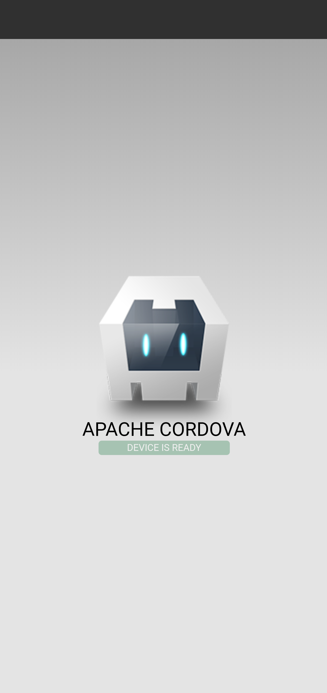
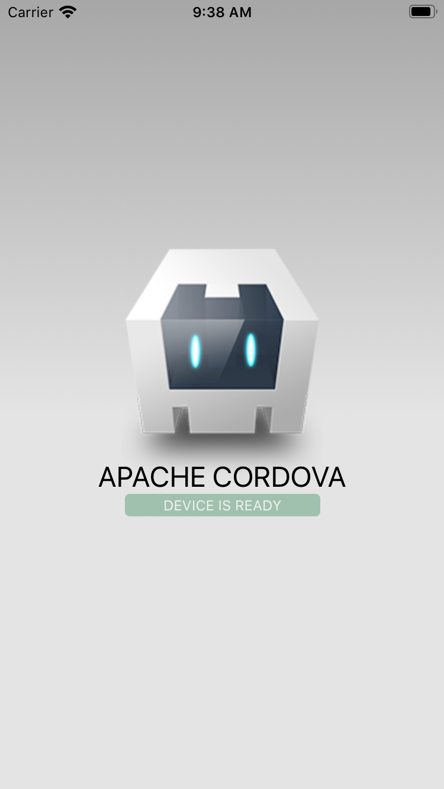
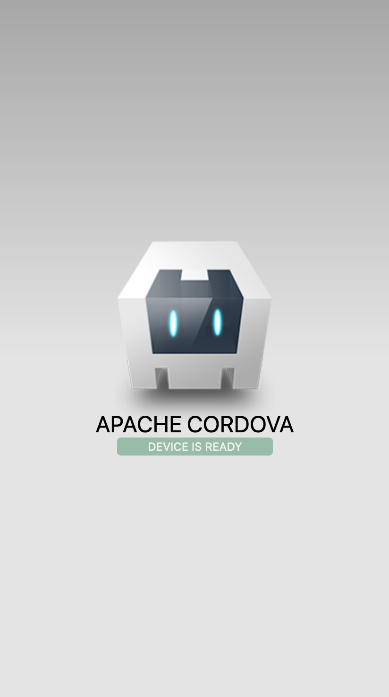
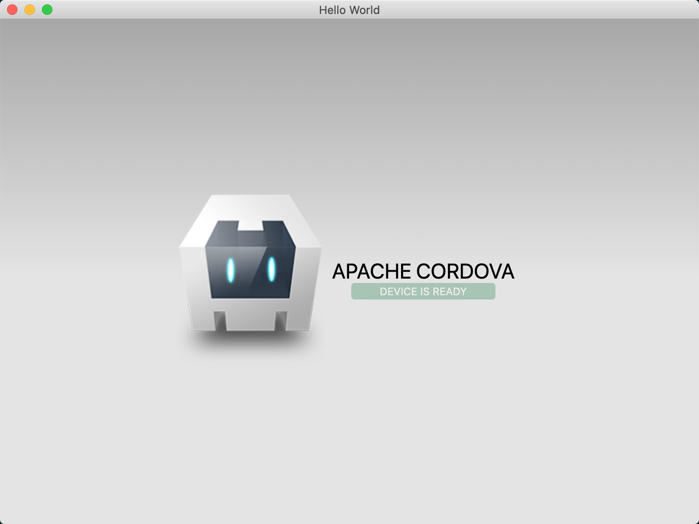
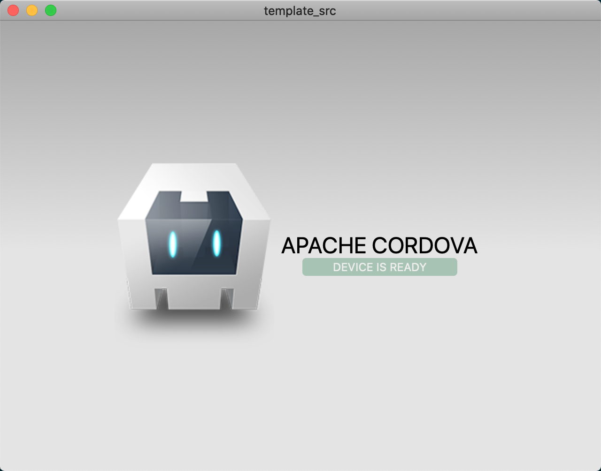

<!--
#
# Licensed to the Apache Software Foundation (ASF) under one
# or more contributor license agreements.  See the NOTICE file
# distributed with this work for additional information
# regarding copyright ownership.  The ASF licenses this file
# to you under the Apache License, Version 2.0 (the
# "License"); you may not use this file except in compliance
# with the License.  You may obtain a copy of the License at
#
# http://www.apache.org/licenses/LICENSE-2.0
#
# Unless required by applicable law or agreed to in writing,
# software distributed under the License is distributed on an
# "AS IS" BASIS, WITHOUT WARRANTIES OR CONDITIONS OF ANY
#  KIND, either express or implied.  See the License for the
# specific language governing permissions and limitations
# under the License.
#
-->

# Apache Cordova Hello World Application

[](https://nodei.co/npm/cordova-app-hello-world/)

A simple Hello World application that serves two purposes:

- It is used as the default app template when creating new projects
- It is a reference for building and publishing custom Cordova Templates

## Structure of your template

```text
template_package
├── package.json (for your template package to be published on npm)
├── index.js
└── template_src (contains template files)
    ├── package.json
    ├── config.xml
    └── (files and folders that make up the template)
```

### Outside of `template_src`

All files outside of `template_src` are used to define parameters about the template. These files are not copied over at creation, so feel free to add a README or any other files outside of `template_src`.

#### index.js

`index.js` points to where the template exists. You'll see that `index.js` usually looks like:

```javascript
const path = require('path');

module.exports = {
    dirname : path.join(__dirname, 'template_src')
};
```

#### package.json

This `package.json` holds *information about the template itself* like its `name`, `version` etc. All templates should contain the keyword `"cordova:template"` so that the template is searchable on npm. For example:

```json
{
    "name": "cordova-example-template",
    "version": "1.0.0",
    "...": "...",
    "keywords": [
        "cordova:template"
    ]
}
```

### Inside of `template_src`

All files inside of `template_src` compose the template from which a user would desire in order to create their project. Everything in this folder is copied over to the created project.

The package.json in `template_src` should be filled with information that describes *the project that would be created from the template*.

If you want to include `.gitignore` files in your template, you have to name them `gitignore` (without a leading dot) instead. They will be renamed to `.gitignore` upon template expansion.


### Preview










